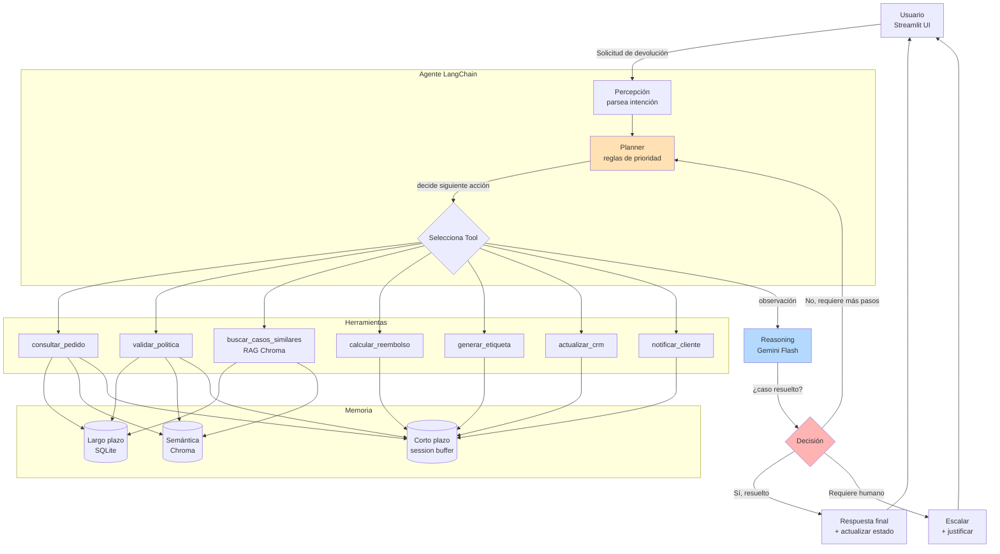

# Diagrama de orquestación del agente

```mermaid
flowchart TD
    U[Usuario<br/>Streamlit UI] -->|Solicitud de devolución| A

    subgraph AGENTE[Agente LangChain]
        A[Percepción<br/>parsea intención] --> P[Planner<br/>reglas de prioridad]
        P -->|decide siguiente acción| T{Selecciona Tool}
    end

    subgraph TOOLS[Herramientas]
        T --> T1[consultar_pedido]
        T --> T2[validar_politica]
        T --> T3[buscar_casos_similares<br/>RAG Chroma]
        T --> T4[calcular_reembolso]
        T --> T5[generar_etiqueta]
        T --> T6[actualizar_crm]
        T --> T7[notificar_cliente]
    end

    subgraph MEM[Memoria]
        M1[(Corto plazo<br/>session buffer)]
        M2[(Largo plazo<br/>SQLite)]
        M3[(Semántica<br/>Chroma)]
    end

    T1 & T2 & T3 --> M2 & M3
    T1 & T2 & T4 & T5 & T6 & T7 --> M1

    T -->|observación| R[Reasoning<br/>Gemini Flash]
    R -->|¿caso resuelto?| D{Decisión}
    D -->|No, requiere más pasos| P
    D -->|Sí, resuelto| F[Respuesta final<br/>+ actualizar estado]
    D -->|Requiere humano| E[Escalar<br/>+ justificar]
    F & E --> U

    style P fill:#ffe1b3
    style R fill:#b3d9ff
    style D fill:#ffb3b3
```
